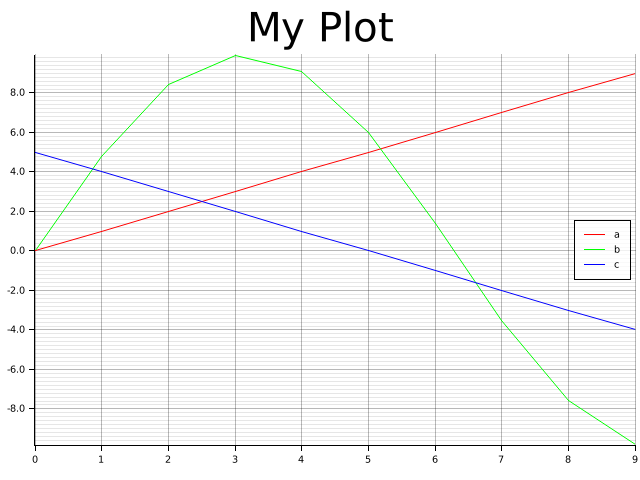

# Debug Plotter

This crate provides a convenient macro to quickly plot variables.

## Example

In this example, we quickly want to plot the variables a, b, and c.
Optionally, we can name the plot. Plots are saved as a PNG in the
`.plots` that is created in the working directory.

```rust
fn main() {
    for a in 0usize..10usize {
        let b = (a as f32 / 2.0).sin() * 10.0;
        let c = 5 - (a as i32);
        debug_plotter::plot!("My Plot"; a, b, c);
    }
}
```

The example above generates a plot named "My PLot" and
saves it to `./plots/My_Plot.png`.



## Debug and Release Mode

Variables are only plotted if your code is run in debug mode.
In release mode, `plot!` macros are ignored.
If you want to avoid compiling the dependencies for this crate in release mode, add `--no-default-features`.