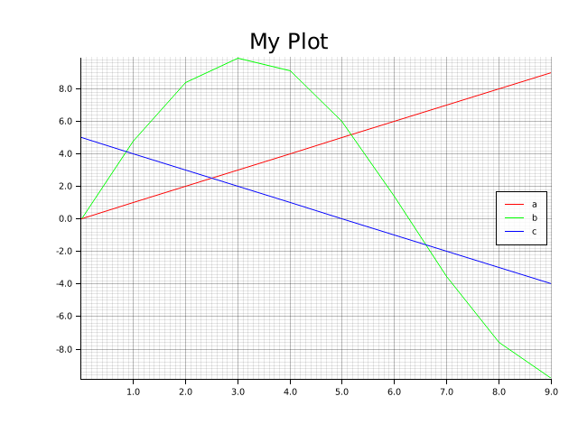
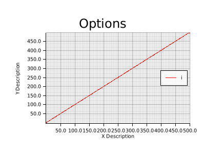
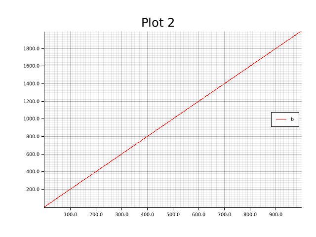

# Examples

## Basic

Specify a list of variables to plot them.

```rust
fn main() {
    for a in 0usize..10usize {
        let b = (a as f32 / 2.0).sin() * 10.0;
        let c = 5 - (a as i32);

        debug_plotter::plot!(a, b, c where caption = "My Plot");
    }
}
```



## Renaming

It's possible to rename variables in the plot.

```rust
fn main() {
    for a in 0usize..10usize {
        let b = (a as f32 / 2.0).sin() * 10.0;
        let c = 5 - (a as i32);

        debug_plotter::plot!(a as "Alice", b as "Bob", c as "Charlie" where caption = "Renaming");
    }
}
```


## Options

This example illustrates some of the possible options.

```rust
fn main() {
    for i in 0usize..1000usize {
        debug_plotter::plot!(
            i where
            caption = "Options",
            size = (400, 300),
            path = "plots/Options.jpg",
            x_desc = "X Description",
            y_desc = "Y Description",
            x_range = 0f64..500f64,
            y_range = 0f64..500f64
        );
    }
}
```



## Tuples

To specify custom values for the x axis, use the tuple notation.

```rust
fn main() {
    for x in 0usize..100usize {
        let x = x as f64 / 100.0 * std::f64::consts::PI * 2.0;
        let sin_x = x.sin();
        let cos_x = x.cos();

        debug_plotter::plot!((x, sin_x) as "sin(x)", (x, cos_x) as "cos(x)" where caption = "Trigonometry", x_desc = "x");
    }
}
```


## Multiple Plots

It is possible to create multiple plots by invoking the macro multiple times.

```rust
fn main() {
    for a in 0usize..1000usize {
        let b = a * 2;
        debug_plotter::plot!(a where caption = "Plot 1");
        debug_plotter::plot!(b where caption = "Plot 2");
    }
}
```




## Live View

Live mode opens a window and plots the variables in real time.

```rust
fn main() {
    let mut i = 0;
    loop {
        let x = i as f64 / 100.0 * std::f64::consts::PI * 2.0;
        let sin_x = x.sin();
        let cos_x = x.cos();

        debug_plotter::plot!(
            (x, sin_x) as "sin(x)",
            (x, cos_x) as "cos(x)"
            where
            caption = "Live Trigonometry",
            x_desc = "x",
            values = 100usize,
            live = true,
            size = (1080, 720)
        );

        i += 1;
    }
}
```


